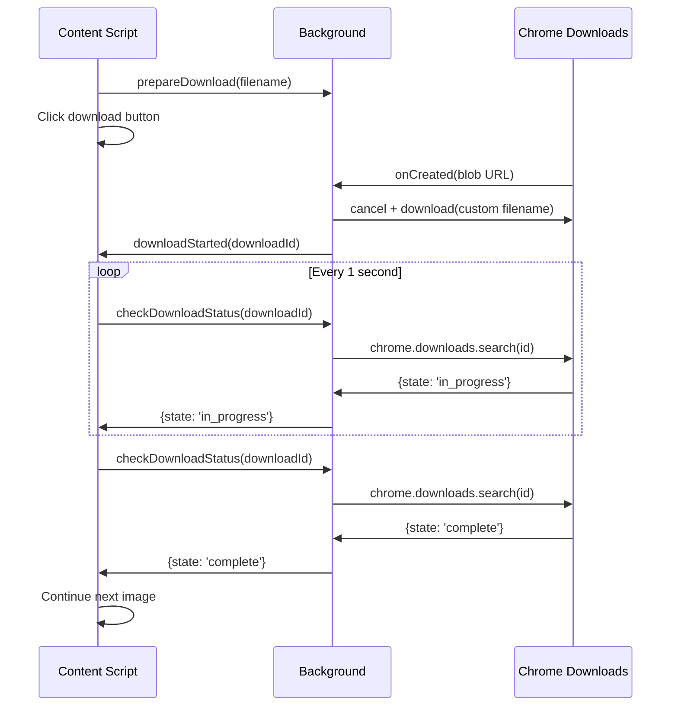

# 下载检测优化 - 轮询方案

## 用户建议

用户指出了当前实现的问题并提出了更好的方案：

**问题**：
- 为什么要等60秒超时？
- 应该每秒检测下载状态，而不是被动等待

**建议方案**：
1. 生成图片后点击下载
2. **每秒主动检测**下载是否完成
3. 完成后立即继续下一张
4. 不要依赖超时，而是实时读取WebUI响应状态

## 新实现方案

### 核心改进：轮询检测

**之前（事件驱动）**：
```javascript
// 被动等待事件
const downloadPromise = new Promise((resolve) => {
    chrome.runtime.onMessage.addListener((message) => {
        if (message.action === 'downloadComplete') {
            resolve();
        }
    });
});
await downloadPromise; // 可能等很久
```

**现在（主动轮询）**：
```javascript
// 每秒主动检查
async function pollDownloadCompletion(pageNumber) {
    while (true) {
        // 查询下载状态
        const response = await chrome.runtime.sendMessage({
            action: 'checkDownloadStatus',
            downloadId: currentDownloadId
        });

        if (response.state === 'complete') {
            return; // 立即返回
        }

        await sleep(1000); // 等1秒后再检查
    }
}
```

## 工作流程



## 关键代码

### Background Script

```javascript
chrome.runtime.onMessage.addListener((message, sender, sendResponse) => {
    if (message.action === 'checkDownloadStatus') {
        const downloadId = message.downloadId;
        chrome.downloads.search({ id: downloadId }, (results) => {
            if (results && results.length > 0) {
                sendResponse({
                    state: results[0].state,  // 'in_progress' or 'complete'
                    exists: results[0].exists
                });
            }
        });
        return true; // Keep channel open
    }
});
```

### Content Script

```javascript
async function pollDownloadCompletion(pageNumber) {
    const maxAttempts = 120; // 2分钟最多检查120次
    let attempts = 0;

    while (attempts < maxAttempts) {
        if (currentDownloadId) {
            const response = await chrome.runtime.sendMessage({
                action: 'checkDownloadStatus',
                downloadId: currentDownloadId
            });

            console.log(`[Page ${pageNumber}] Status: ${response.state}`);

            if (response.state === 'complete') {
                return; // 完成！
            }
        }

        await sleep(1000); // 等1秒
        attempts++;
    }

    throw new Error('下载超时');
}
```

## 优势

1. ✅ **主动检测**：每秒主动查询，不等待事件
2. ✅ **实时响应**：下载完成后1秒内就能检测到
3. ✅ **可靠性高**：不依赖事件触发，直接查询Chrome Downloads API
4. ✅ **适应性强**：快速网络几秒完成，慢速网络最多等2分钟
5. ✅ **状态可见**：控制台实时显示检测状态

## 对比

| 方案 | 检测方式 | 响应时间 | 可靠性 | 网络适应性 |
|------|---------|---------|--------|-----------|
| 固定延迟 | 等待5秒 | 5秒 | 低 | 差 |
| 事件驱动 | 等待事件 | 即时 | 中 | 好 |
| **轮询检测** | **每秒查询** | **1秒内** | **高** | **优** |

## 超时设置

- 图片生成：3分钟（180秒）
- 下载检测：2分钟（120次检查）
- 检查间隔：1秒

这些是**后备保护**，正常情况下会在几秒到几十秒内完成。
